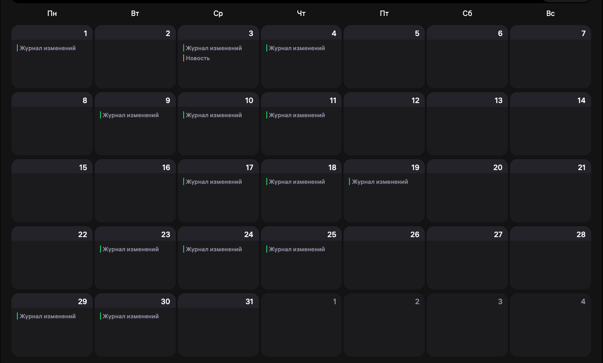

# Wildberries SDK-клиенты для Python, Node.js, Go, PHP и Rust, постоянно актуальные в соответствии с OpenAPI-спецификациями.

🌐 **Русский** · [English](docs/i18n/README.en.md) · [简体中文](docs/i18n/README.zh-CN.md) · [Türkçe](docs/i18n/README.tr.md) · [Қазақша](docs/i18n/README.kk.md) · [Oʻzbekcha](docs/i18n/README.uz.md)

| Язык | Версия | Кол-во скачиваний | README | Репозиторий |
| --- | --- | --- | --- | --- |
| Python |  |  | [docs/python/README.md](docs/python/README.md) | [pypi.org](https://pypi.org/project/wildberries-sdk/) |
| Node.js |  |  | [docs/npm/README.md](docs/npm/README.md) | [npmjs.com](https://www.npmjs.com/package/wildberries-sdk) |
| PHP |  |  | [docs/php/README.md](docs/php/README.md) | [packagist.org](https://packagist.org/packages/eslazarev/wildberries-sdk) |
| Go |  | — | [docs/go/README.md](docs/go/README.md) | [pkg.go.dev](https://pkg.go.dev/github.com/eslazarev/wildberries-sdk/clients/go/finances) |
| Rust |  | — | [docs/rust/README.md](docs/rust/README.md) | [crates.io](https://crates.io/crates/wildberries_sdk_finances) |

## Безопасность

SDK выпускается с security-first процессом:

- статический анализ кода CodeQL
- оценка по OpenSSF Scorecard
- сканирование секретов TruffleHog (verified-режим)
- аудит зависимостей Python (pip-audit)
- npm audit
- Composer audit
- Cargo audit
- проверка уязвимостей Go (govulncheck)
- в опубликованных пакетах нет захардкоженных API-токенов

Поддерживаются все доступные на текущий момент команды API Wildberries, разделённые по спецификациям.

## Описание SDK-клиентов

- **Полная типизация запросов и ответов.** В каждом языке клиент использует нативную систему типов: pydantic в Python, TypeScript-интерфейсы в Node.js, struct-ы в Go, типизированные классы в PHP, serde-структуры в Rust. Опечатки в полях и неверные типы ловятся ещё при компиляции/линтинге.
- **Автодополнение в IDE из коробки.** Имена методов, параметры, поля моделей и значения enum-ов подсвечиваются и подсказываются — без чтения документации WB.
- **Описания и docstring-и из спецификаций.** Комментарии WB по полям и методам переносятся в код, всплывают при наведении в IDE.
- **Валидация на стороне клиента.** Обязательные поля и типы проверяются до отправки запроса. В Python pydantic дополнительно валидирует форматы, enum-значения и ограничения min/max; в Go, TypeScript, PHP и Rust проверка ограничивается обязательными полями и типами.
- **Один контракт во всех языках.** Имена операций, поля моделей и эндпоинты идентичны в Python, Node.js, Go, PHP и Rust — миграция между стеками без переписывания бизнес-логики.
- **Никакого дрейфа со спецификациями.** Когда WB обновляет API, ваш SDK получает новые методы и модели с PR того же дня — не нужно вручную вычислять, что изменилось.
- **Готовый transport-слой.** Аутентификация, заголовки, базовые URL, сериализация JSON, обработка HTTP-ошибок — реализованы один раз в стандартном api_client и переиспользуются всеми методами.

### Автоматическая клиенты поддерживаются в актуальном состоянии с помощью GitHub Actions при обновлении спецификаций.

Почему это важно?

Вот изменения спецификаций: [CHANGELOG.md](CHANGELOG.md)

Случаются часто — несколько раз в неделю.

[//]: # ()

[//]: # (#### За месяц 14 изменений в спецификациях. )

## В данный момент представлены **все доступные** спецификации:

- Общее: [`specs/01-general.yaml`](#общее-01-generalyaml)
- Работа с товарами: [`specs/02-products.yaml`](#работа-с-товарами-02-productsyaml)
- Заказы FBS: [`specs/03-orders-fbs.yaml`](#заказы-fbs-03-orders-fbsyaml)
- Заказы DBW: [`specs/04-orders-dbw.yaml`](#заказы-dbw-04-orders-dbwyaml)
- Заказы DBS: [`specs/05-orders-dbs.yaml`](#заказы-dbs-05-orders-dbsyaml)
- Заказы Самовывоз: [`specs/06-in-store-pickup.yaml`](#заказы-самовывоз-06-in-store-pickupyaml)
- Поставки FBW: [`specs/07-orders-fbw.yaml`](#поставки-fbw-07-orders-fbwyaml)
- Маркетинг и продвижение: [`specs/08-promotion.yaml`](#маркетинг-и-продвижение-08-promotionyaml)
- Общение с покупателями: [`specs/09-communications.yaml`](#общение-с-покупателями-09-communicationsyaml)
- Тарифы: [`specs/10-tariffs.yaml`](#тарифы-10-tariffsyaml)
- Аналитика и данные: [`specs/11-analytics.yaml`](#аналитика-и-данные-11-analyticsyaml)
- Отчёты: [`specs/12-reports.yaml`](#отчёты-12-reportsyaml)
- Документы и бухгалтерия: [`specs/13-finances.yaml`](#документы-и-бухгалтерия-13-financesyaml)
- Wildberries Цифровой: [`specs/14-wbd.yaml`](#wildberries-цифровой-14-wbdyaml)

<!-- METHODS_LIST_START -->
### Общее (`01-general.yaml`)
- `GET /api/common/v1/rating` — Получить рейтинг продавца (getCommonV1Rating)
- `GET /api/common/v1/subscriptions` — Получить информацию о подписке Джем (getCommonV1Subscriptions)
- `GET /api/communications/v2/news` — Получение новостей портала продавцов
- `POST /api/v1/invite` — Создать приглашение для нового пользователя
- `GET /api/v1/seller-info` — Получить информацию о продавце
- `DELETE /api/v1/user` — Удалить пользователя
- `GET /api/v1/users` — Получить список активных или приглашённых пользователей продавца
- `PUT /api/v1/users/access` — Изменить права доступа пользователей
- `GET /ping` — Проверка подключения

### Работа с товарами (`02-products.yaml`)
- `GET /api/content/v1/brands` — Бренды
- `GET /api/v2/buffer/goods/task` — Детализация необработанной загрузки
- `GET /api/v2/buffer/tasks` — Состояние необработанной загрузки
- `GET /api/v2/history/goods/task` — Детализация обработанной загрузки
- `GET /api/v2/history/tasks` — Состояние обработанной загрузки
- `GET /api/v2/list/goods/filter` — Получить товары с ценами
- `POST /api/v2/list/goods/filter` — Получить товары с ценами по артикулам
- `GET /api/v2/list/goods/size/nm` — Получить размеры товара с ценами
- `GET /api/v2/quarantine/goods` — Получить товары в карантине
- `POST /api/v2/upload/task` — Установить цены и скидки
- `POST /api/v2/upload/task/club-discount` — Установить скидки WB Клуба
- `POST /api/v2/upload/task/size` — Установить цены для размеров
- `GET /api/v3/dbw/warehouses/{warehouseId}/contacts` — Список контактов
- `PUT /api/v3/dbw/warehouses/{warehouseId}/contacts` — Обновить список контактов
- `GET /api/v3/offices` — Получить список складов WB
- `POST /api/v3/stocks/{warehouseId}` — Получить остатки товаров
- `PUT /api/v3/stocks/{warehouseId}` — Обновить остатки товаров
- `DELETE /api/v3/stocks/{warehouseId}` — Удалить остатки товаров
- `GET /api/v3/warehouses` — Получить список складов продавца
- `POST /api/v3/warehouses` — Создать склад продавца
- `PUT /api/v3/warehouses/{warehouseId}` — Обновить склад продавца
- `DELETE /api/v3/warehouses/{warehouseId}` — Удалить склад продавца
- `POST /content/v2/barcodes` — Генерация баркодов
- `POST /content/v2/cards/delete/trash` — Перенос карточек товаров в корзину
- `POST /content/v2/cards/error/list` — Список несозданных карточек товаров с ошибками
- `GET /content/v2/cards/limits` — Лимиты карточек товаров
- `POST /content/v2/cards/moveNm` — Объединение и разъединение карточек товаров
- `POST /content/v2/cards/recover` — Восстановление карточек товаров из корзины
- `POST /content/v2/cards/update` — Редактирование карточек товаров
- `POST /content/v2/cards/upload` — Создание карточек товаров
- `POST /content/v2/cards/upload/add` — Создание карточек товаров с присоединением
- `GET /content/v2/directory/colors` — Цвет
- `GET /content/v2/directory/countries` — Страна производства
- `GET /content/v2/directory/kinds` — Пол
- `GET /content/v2/directory/seasons` — Сезон
- `GET /content/v2/directory/tnved` — ТНВЭД-код
- `GET /content/v2/directory/vat` — Ставка НДС
- `POST /content/v2/get/cards/list` — Список карточек товаров
- `POST /content/v2/get/cards/trash` — Список карточек товаров в корзине
- `GET /content/v2/object/all` — Список предметов
- `GET /content/v2/object/charcs/{subjectId}` — Характеристики предмета
- `GET /content/v2/object/parent/all` — Родительские категории товаров
- `POST /content/v2/tag` — Создание ярлыка
- `POST /content/v2/tag/nomenclature/link` — Управление ярлыками в карточке товара
- `PATCH /content/v2/tag/{id}` — Изменение ярлыка
- `DELETE /content/v2/tag/{id}` — Удаление ярлыка
- `GET /content/v2/tags` — Список ярлыков
- `POST /content/v3/media/file` — Загрузить медиафайл
- `POST /content/v3/media/save` — Загрузить медиафайлы по ссылкам

### Заказы FBS (`03-orders-fbs.yaml`)
- `GET /api/marketplace/v3/fbs/orders/archive` — Получить список архивных сборочных заданий
- `POST /api/marketplace/v3/orders/meta` — Получить метаданные сборочных заданий
- `PUT /api/marketplace/v3/orders/{orderId}/meta/customs-declaration` — Закрепить за сборочным заданием номер ГТД
- `GET /api/marketplace/v3/supplies/{supplyId}/order-ids` — Получить ID сборочных заданий поставки
- `PATCH /api/marketplace/v3/supplies/{supplyId}/orders` — Добавить сборочные задания к поставке
- `GET /api/v3/orders` — Получить информацию о сборочных заданиях
- `POST /api/v3/orders/client` — Заказы с информацией по клиенту
- `GET /api/v3/orders/new` — Получить список новых сборочных заданий
- `POST /api/v3/orders/status` — Получить статусы сборочных заданий
- `POST /api/v3/orders/status/history` — История статусов для сборочных заданий трансграничных поставок
- `POST /api/v3/orders/stickers` — Получить стикеры сборочных заданий
- `POST /api/v3/orders/stickers/cross-border` — Получить стикеры сборочных заданий трансграничных поставок
- `PATCH /api/v3/orders/{orderId}/cancel` — Отменить сборочное задание
- `DELETE /api/v3/orders/{orderId}/meta` — Удалить метаданные сборочного задания
- `PUT /api/v3/orders/{orderId}/meta/expiration` — Закрепить за сборочным заданием срок годности товара
- `PUT /api/v3/orders/{orderId}/meta/gtin` — Закрепить за сборочным заданием GTIN
- `PUT /api/v3/orders/{orderId}/meta/imei` — Закрепить за сборочным заданием IMEI
- `PUT /api/v3/orders/{orderId}/meta/sgtin` — Закрепить за сборочным заданием код маркировки Честного знака
- `PUT /api/v3/orders/{orderId}/meta/uin` — Закрепить за сборочным заданием УИН
- `GET /api/v3/passes` — Получить список пропусков
- `POST /api/v3/passes` — Создать пропуск
- `GET /api/v3/passes/offices` — Получить список складов, для которых требуется пропуск
- `PUT /api/v3/passes/{passId}` — Обновить пропуск
- `DELETE /api/v3/passes/{passId}` — Удалить пропуск
- `GET /api/v3/supplies` — Получить список поставок
- `POST /api/v3/supplies` — Создать новую поставку
- `GET /api/v3/supplies/orders/reshipment` — Получить все сборочные задания для повторной отгрузки
- `GET /api/v3/supplies/{supplyId}` — Получить информацию о поставке
- `DELETE /api/v3/supplies/{supplyId}` — Удалить поставку
- `GET /api/v3/supplies/{supplyId}/barcode` — Получить QR-код поставки
- `PATCH /api/v3/supplies/{supplyId}/deliver` — Передать поставку в доставку
- `GET /api/v3/supplies/{supplyId}/trbx` — Получить список грузомест поставки
- `POST /api/v3/supplies/{supplyId}/trbx` — Добавить грузоместа к поставке
- `DELETE /api/v3/supplies/{supplyId}/trbx` — Удалить грузоместа из поставки
- `POST /api/v3/supplies/{supplyId}/trbx/stickers` — Получить стикеры грузомест поставки

### Заказы DBW (`04-orders-dbw.yaml`)
- `POST /api/marketplace/v3/dbw/orders/client` — Информация о покупателе
- `POST /api/marketplace/v3/dbw/orders/meta/delete` — Удалить метаданные сборочных заданий
- `POST /api/marketplace/v3/dbw/orders/meta/details` — Получить метаданные сборочных заданий
- `POST /api/marketplace/v3/dbw/orders/meta/sgtin` — Закрепить коды маркировки Честного знака за сборочными заданиями
- `POST /api/marketplace/v3/dbw/orders/status/deliver` — Перевести сборочные задания в доставку
- `GET /api/v3/dbw/orders` — Получить информацию о завершенных сборочных заданиях
- `POST /api/v3/dbw/orders/courier` — Информация о курьере
- `POST /api/v3/dbw/orders/delivery-date` — Дата и время доставки
- `GET /api/v3/dbw/orders/new` — Получить список новых сборочных заданий
- `POST /api/v3/dbw/orders/status` — Получить статусы сборочных заданий
- `POST /api/v3/dbw/orders/stickers` — Получить стикеры сборочных заданий
- `PATCH /api/v3/dbw/orders/{orderId}/assemble` — Перевести в доставку
- `PATCH /api/v3/dbw/orders/{orderId}/cancel` — Отменить сборочное задание
- `PATCH /api/v3/dbw/orders/{orderId}/confirm` — Перевести на сборку
- `GET /api/v3/dbw/orders/{orderId}/meta` — Получить метаданные сборочного задания
- `DELETE /api/v3/dbw/orders/{orderId}/meta` — Удалить метаданные сборочного задания
- `PUT /api/v3/dbw/orders/{orderId}/meta/gtin` — Закрепить за сборочным заданием GTIN
- `PUT /api/v3/dbw/orders/{orderId}/meta/imei` — Закрепить за сборочным заданием IMEI
- `PUT /api/v3/dbw/orders/{orderId}/meta/sgtin` — Закрепить за сборочным заданием код маркировки товара
- `PUT /api/v3/dbw/orders/{orderId}/meta/uin` — Закрепить за сборочным заданием УИН (уникальный идентификационный номер)

### Заказы DBS (`05-orders-dbs.yaml`)
- `POST /api/marketplace/v3/dbs/orders/b2b/info` — Информация о покупателе B2B
- `POST /api/marketplace/v3/dbs/orders/meta/customs-declaration` — Закрепить за сборочными заданиями номер ГТД
- `POST /api/marketplace/v3/dbs/orders/meta/delete` — Удалить метаданные сборочных заданий
- `POST /api/marketplace/v3/dbs/orders/meta/details` — Получить метаданные сборочных заданий
- `POST /api/marketplace/v3/dbs/orders/meta/gtin` — Закрепить GTIN за сборочными заданиями
- `POST /api/marketplace/v3/dbs/orders/meta/imei` — Закрепить IMEI за сборочными заданиями
- `POST /api/marketplace/v3/dbs/orders/meta/info` — Получить метаданные сборочных заданий
- `POST /api/marketplace/v3/dbs/orders/meta/sgtin` — Закрепить коды маркировки Честного знака за сборочными заданиями
- `POST /api/marketplace/v3/dbs/orders/meta/uin` — Закрепить УИН за сборочными заданиями
- `POST /api/marketplace/v3/dbs/orders/status/cancel` — Отменить сборочные задания
- `POST /api/marketplace/v3/dbs/orders/status/confirm` — Перевести сборочные задания на сборку
- `POST /api/marketplace/v3/dbs/orders/status/deliver` — Перевести сборочные задания в доставку
- `POST /api/marketplace/v3/dbs/orders/status/info` — Получить статусы сборочных заданий
- `POST /api/marketplace/v3/dbs/orders/status/receive` — Сообщить о получении заказов
- `POST /api/marketplace/v3/dbs/orders/status/reject` — Сообщить об отказе от заказов
- `POST /api/marketplace/v3/dbs/orders/stickers` — Получить стикеры для сборочных заданий с доставкой в ПВЗ
- `POST /api/v3/dbs/groups/info` — Получить информацию о платной доставке
- `GET /api/v3/dbs/orders` — Получить информацию о завершенных сборочных заданиях
- `POST /api/v3/dbs/orders/client` — Информация о покупателе
- `POST /api/v3/dbs/orders/delivery-date` — Дата и время доставки
- `GET /api/v3/dbs/orders/new` — Получить список новых сборочных заданий

### Заказы Самовывоз (`06-in-store-pickup.yaml`)
- `POST /api/marketplace/v3/click-collect/orders/meta/delete` — Удалить метаданные сборочных заданий
- `POST /api/marketplace/v3/click-collect/orders/meta/gtin` — Закрепить GTIN за сборочными заданиями
- `POST /api/marketplace/v3/click-collect/orders/meta/imei` — Закрепить IMEI за сборочными заданиями
- `POST /api/marketplace/v3/click-collect/orders/meta/info` — Получить метаданные сборочных заданий
- `POST /api/marketplace/v3/click-collect/orders/meta/sgtin` — Закрепить коды маркировки Честного знака за сборочными заданиями
- `POST /api/marketplace/v3/click-collect/orders/meta/uin` — Закрепить УИН за сборочными заданиями
- `POST /api/marketplace/v3/click-collect/orders/status/cancel` — Отменить сборочные задания
- `POST /api/marketplace/v3/click-collect/orders/status/confirm` — Перевести сборочные задания на сборку
- `POST /api/marketplace/v3/click-collect/orders/status/info` — Получить статусы сборочных заданий
- `POST /api/marketplace/v3/click-collect/orders/status/prepare` — Сообщить, что сборочные задания готовы к выдаче
- `POST /api/marketplace/v3/click-collect/orders/status/receive` — Сообщить, что заказы приняты покупателями
- `POST /api/marketplace/v3/click-collect/orders/status/reject` — Сообщить об отказе от заказов
- `GET /api/v3/click-collect/orders` — Получить информацию о завершённых сборочных заданиях
- `POST /api/v3/click-collect/orders/client` — Информация о покупателе
- `POST /api/v3/click-collect/orders/client/identity` — Проверить, что заказ принадлежит покупателю
- `GET /api/v3/click-collect/orders/new` — Получить список новых сборочных заданий
- `POST /api/v3/click-collect/orders/status` — Получить статусы сборочных заданий
- `PATCH /api/v3/click-collect/orders/{orderId}/cancel` — Отменить сборочное задание
- `PATCH /api/v3/click-collect/orders/{orderId}/confirm` — Перевести на сборку
- `GET /api/v3/click-collect/orders/{orderId}/meta` — Получить метаданные сборочного задания
- `DELETE /api/v3/click-collect/orders/{orderId}/meta` — Удалить метаданные сборочного задания
- `PUT /api/v3/click-collect/orders/{orderId}/meta/gtin` — Закрепить за сборочным заданием GTIN
- `PUT /api/v3/click-collect/orders/{orderId}/meta/imei` — Закрепить за сборочным заданием IMEI
- `PUT /api/v3/click-collect/orders/{orderId}/meta/sgtin` — Закрепить за сборочным заданием код маркировки товара
- `PUT /api/v3/click-collect/orders/{orderId}/meta/uin` — Закрепить за сборочным заданием УИН (уникальный идентификационный номер)
- `PATCH /api/v3/click-collect/orders/{orderId}/prepare` — Сообщить, что сборочное задание готово к выдаче
- `PATCH /api/v3/click-collect/orders/{orderId}/receive` — Сообщить, что заказ принят покупателем
- `PATCH /api/v3/click-collect/orders/{orderId}/reject` — Сообщить, что покупатель отказался от заказа

### Поставки FBW (`07-orders-fbw.yaml`)
- `POST /api/v1/acceptance/options` — Опции приёмки
- `POST /api/v1/supplies` — Список поставок
- `GET /api/v1/supplies/{ID}` — Детали поставки
- `GET /api/v1/supplies/{ID}/goods` — Товары поставки
- `GET /api/v1/supplies/{ID}/package` — Упаковка поставки
- `GET /api/v1/transit-tariffs` — Транзитные направления
- `GET /api/v1/warehouses` — Список складов

### Маркетинг и продвижение (`08-promotion.yaml`)
- `PATCH /adv/v0/auction/nms` — Изменение списка карточек товаров в кампаниях
- `PUT /adv/v0/auction/placements` — Изменение мест размещения в кампаниях с ручной ставкой
- `GET /adv/v0/delete` — Удаление кампании
- `POST /adv/v0/normquery/bids` — Установить ставки для поисковых кластеров
- `DELETE /adv/v0/normquery/bids` — Удалить ставки поисковых кластеров
- `POST /adv/v0/normquery/get-bids` — Список ставок поисковых кластеров
- `POST /adv/v0/normquery/get-minus` — Список минус-фраз кампаний
- `POST /adv/v0/normquery/list` — Списки активных и неактивных поисковых кластеров
- `POST /adv/v0/normquery/set-minus` — Установка и удаление минус-фраз
- `POST /adv/v0/normquery/stats` — Статистика поисковых кластеров
- `GET /adv/v0/pause` — Пауза кампании
- `POST /adv/v0/rename` — Переименование кампании
- `GET /adv/v0/start` — Запуск кампании
- `GET /adv/v0/stop` — Завершение кампании
- `GET /adv/v1/advert` — Информация о медиакампании
- `GET /adv/v1/adverts` — Список медиакампаний
- `GET /adv/v1/balance` — Баланс
- `GET /adv/v1/budget` — Бюджет кампании
- `POST /adv/v1/budget/deposit` — Пополнение бюджета кампании
- `GET /adv/v1/count` — Количество медиакампаний
- `POST /adv/v1/normquery/stats` — Статистика по поисковым кластерам с детализацией по дням
- `GET /adv/v1/payments` — Получение истории пополнений счёта
- `GET /adv/v1/promotion/count` — Списки кампаний
- `POST /adv/v1/stats` — Статистика медиакампаний
- `GET /adv/v1/supplier/subjects` — Предметы для кампаний
- `GET /adv/v1/upd` — Получение истории затрат
- `POST /adv/v2/seacat/save-ad` — Создать кампанию
- `POST /adv/v2/supplier/nms` — Карточки товаров для кампаний
- `GET /adv/v3/fullstats` — Статистика кампаний
- `GET /api/advert/v0/bids/recommendations` — Рекомендуемые ставки для карточек товаров и поисковых кластеров
- `PATCH /api/advert/v1/bids` — Изменение ставок в кампаниях
- `POST /api/advert/v1/bids/min` — Минимальные ставки для карточек товаров
- `GET /api/advert/v2/adverts` — Информация о кампаниях
- `GET /api/v1/calendar/promotions` — Список акций
- `GET /api/v1/calendar/promotions/details` — Детальная информация об акциях
- `GET /api/v1/calendar/promotions/nomenclatures` — Список товаров для участия в акции
- `POST /api/v1/calendar/promotions/upload` — Добавить товар в акцию

### Общение с покупателями (`09-communications.yaml`)
- `GET /api/feedbacks/v1/pins` — Список закреплённых и откреплённых отзывов
- `POST /api/feedbacks/v1/pins` — Закрепить отзывы
- `DELETE /api/feedbacks/v1/pins` — Открепить отзывы
- `GET /api/feedbacks/v1/pins/count` — Количество закреплённых и откреплённых отзывов
- `GET /api/feedbacks/v1/pins/limits` — Лимиты закреплённых отзывов
- `PATCH /api/v1/claim` — Ответ на заявку покупателя
- `GET /api/v1/claims` — Заявки покупателей на возврат
- `GET /api/v1/feedback` — Получить отзыв по ID
- `GET /api/v1/feedbacks` — Список отзывов
- `POST /api/v1/feedbacks/answer` — Ответить на отзыв
- `PATCH /api/v1/feedbacks/answer` — Отредактировать ответ на отзыв
- `GET /api/v1/feedbacks/archive` — Список архивных отзывов
- `GET /api/v1/feedbacks/count` — Количество отзывов
- `GET /api/v1/feedbacks/count-unanswered` — Необработанные отзывы
- `POST /api/v1/feedbacks/order/return` — Возврат товара по ID отзыва
- `GET /api/v1/new-feedbacks-questions` — Непросмотренные отзывы и вопросы
- `GET /api/v1/question` — Получить вопрос по ID
- `GET /api/v1/questions` — Список вопросов
- `PATCH /api/v1/questions` — Работа с вопросами
- `GET /api/v1/questions/count` — Количество вопросов
- `GET /api/v1/questions/count-unanswered` — Неотвеченные вопросы
- `GET /api/v1/seller/chats` — Список чатов
- `GET /api/v1/seller/download/{id}` — Получить файл из сообщения
- `GET /api/v1/seller/events` — События чатов
- `POST /api/v1/seller/message` — Отправить сообщение

### Тарифы (`10-tariffs.yaml`)
- `GET /api/tariffs/v1/acceptance/coefficients` — Тарифы на поставку
- `GET /api/v1/tariffs/box` — Тарифы для коробов
- `GET /api/v1/tariffs/commission` — Комиссия по категориям товаров
- `GET /api/v1/tariffs/pallet` — Тарифы для монопаллет
- `GET /api/v1/tariffs/return` — Тарифы на возврат

### Аналитика и данные (`11-analytics.yaml`)
- `POST /api/analytics/v1/stocks-report/wb-warehouses` — Остатки на складах WB (postV1StocksReportWbWarehouses)
- `POST /api/analytics/v3/sales-funnel/grouped/history` — Статистика групп карточек товаров по дням (postSalesFunnelGroupedHistory)
- `POST /api/analytics/v3/sales-funnel/products` — Статистика карточек товаров за период (postSalesFunnelProducts)
- `POST /api/analytics/v3/sales-funnel/products/history` — Статистика карточек товаров по дням (postSalesFunnelProductsHistory)
- `GET /api/v2/nm-report/downloads` — Получить список отчётов
- `POST /api/v2/nm-report/downloads` — Создать отчёт
- `GET /api/v2/nm-report/downloads/file/{downloadId}` — Получить отчёт
- `POST /api/v2/nm-report/downloads/retry` — Сгенерировать отчёт повторно
- `POST /api/v2/search-report/product/orders` — Заказы и позиции по поисковым запросам товара
- `POST /api/v2/search-report/product/search-texts` — Поисковые запросы по товару
- `POST /api/v2/search-report/report` — Основная страница
- `POST /api/v2/search-report/table/details` — Пагинация по товарам в группе
- `POST /api/v2/search-report/table/groups` — Пагинация по группам
- `POST /api/v2/stocks-report/offices` — Данные по складам
- `POST /api/v2/stocks-report/products/groups` — Данные по группам
- `POST /api/v2/stocks-report/products/products` — Данные по товарам
- `POST /api/v2/stocks-report/products/sizes` — Данные по размерам

### Отчёты (`12-reports.yaml`)
- `GET /api/analytics/v1/deductions` — Подмены и неверные вложения (getDeductions)
- `GET /api/analytics/v1/measurement-penalties` — Удержания за занижение габаритов упаковки (getMeasurementPenalties)
- `GET /api/analytics/v1/warehouse-measurements` — Замеры склада (getWarehouseMeasurements)
- `GET /api/v1/acceptance_report` — Создать отчёт
- `GET /api/v1/acceptance_report/tasks/{task_id}/download` — Получить отчёт
- `GET /api/v1/acceptance_report/tasks/{task_id}/status` — Проверить статус
- `GET /api/v1/analytics/antifraud-details` — Самовыкупы
- `GET /api/v1/analytics/banned-products/blocked` — Заблокированные карточки
- `GET /api/v1/analytics/banned-products/shadowed` — Скрытые из каталога
- `GET /api/v1/analytics/brand-share` — Получить отчёт
- `GET /api/v1/analytics/brand-share/brands` — Бренды продавца
- `GET /api/v1/analytics/brand-share/parent-subjects` — Родительские категории бренда
- `POST /api/v1/analytics/excise-report` — Получить отчёт
- `GET /api/v1/analytics/goods-labeling` — Маркировка товара
- `GET /api/v1/analytics/goods-return` — Получить отчёт
- `GET /api/v1/analytics/region-sale` — Получить отчёт
- `GET /api/v1/paid_storage` — Создать отчёт
- `GET /api/v1/paid_storage/tasks/{task_id}/download` — Получить отчёт
- `GET /api/v1/paid_storage/tasks/{task_id}/status` — Проверить статус
- `GET /api/v1/supplier/orders` — Заказы
- `GET /api/v1/supplier/sales` — Продажи
- `GET /api/v1/supplier/stocks` — Склады
- `GET /api/v1/warehouse_remains` — Создать отчёт
- `GET /api/v1/warehouse_remains/tasks/{task_id}/download` — Получить отчёт
- `GET /api/v1/warehouse_remains/tasks/{task_id}/status` — Проверить статус

### Документы и бухгалтерия (`13-finances.yaml`)
- `POST /api/finance/v1/acquiring/detailed` — Детализации к отчётам об издержках на приём платежей за период (postV1AcquiringDetailed)
- `POST /api/finance/v1/acquiring/detailed/{reportId}` — Детализации к отчётам об издержках на приём платежей по ID отчётов (postV1AcquiringDetailedReportId)
- `POST /api/finance/v1/acquiring/list` — Список отчётов об издержках на приём платежей (postV1AcquiringList)
- `POST /api/finance/v1/sales-reports/detailed` — Детализации к отчётам реализации за период (postV1SalesReportsDetailed)
- `POST /api/finance/v1/sales-reports/detailed/{reportId}` — Детализации к отчётам реализации по ID отчётов (postV1SalesReportsDetailedReportId)
- `POST /api/finance/v1/sales-reports/list` — Список отчётов реализации (postV1SalesReportsList)
- `GET /api/v1/account/balance` — Получить баланс продавца
- `GET /api/v1/documents/categories` — Категории документов
- `GET /api/v1/documents/download` — Получить документ
- `POST /api/v1/documents/download/all` — Получить документы
- `GET /api/v1/documents/list` — Список документов
- `GET /api/v5/supplier/reportDetailByPeriod` — Отчёт о продажах по реализации
<!-- METHODS_LIST_END -->
